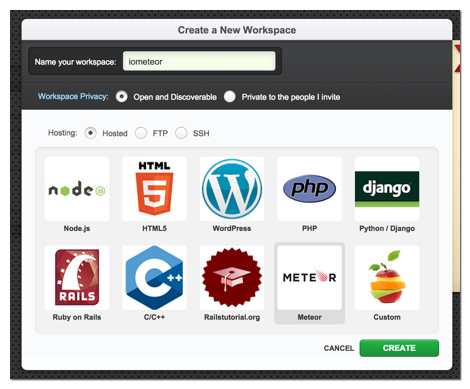
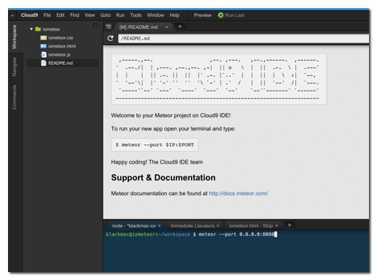

# Die Entwicklungsumgebung einrichten

## Lokal auf dem eigenen Rechner entwickeln

Die lokale Entwicklung ist vergleichsweise kompliziert zu konfigurieren.
Einfacher ist es direkt die [Online IDE Cloud9](#cloud9) zu verwenden.

### Meteor installieren

Um die neueste Version von Meteor unter Linux und Mac OS X zu installieren öffnest du eine Kommandozeile und führst folgenden Befehl aus:

    curl https://install.meteor.com/ | sh

Für Windows gibt es eine Experimentelle Version unter https://github.com/meteor/meteor/wiki/Preview-of-Meteor-on-Windows

### Ein Meteor Projekt anlegen

Jetzt musst du ein meteor Projekt anlegen um loslegen zu können. Das funktioniert
ganz einfach mit dem Befehl

    cd ~
    meteor create iometeor

Statt `iometeor` kannst du einen beliebigen Namen für dein Projekt verwenden.

Das von meteor angelegte Beispielprojekt kannst du jetzt direkt ausführen.

    cd ~/iometeor
    meteor

Du kannst sofort auf das Projekt zugreifen indem du die ausgegebene URL in den
Browser kopierst.

### Zugriff von Aussen

Damit [sipgate.io](http://sipgate.io) deinen Webservice auch ansprechen kann muss dein Projekt
aus dem Internet erreichbar sein. Das kann zwar mit Hilfe von
Portweiterleitungen erreicht werden, diese einzurichten ist aber oft kompliziert.
Eine bequemere Alternative sind [Tunneldienste](http://www.sitepoint.com/accessing-localhost-from-anywhere/).
Ich verwende für unser Beispiel [http://proxylocal.com/](http://proxylocal.com/),
da dieser Dienst keine Anmeldung erfordert und einfach einzurichten ist.
Solltest Du kein Ruby installieren wollen oder können tut es aber auch ein
beliebiger anderer Service von
der [Liste der Tunneldienste](http://proxylocal.com/).

Um Proxylocal zu installieren brauchst du Ruby (bei Mac OS X ist das immer dabei).

    gem install proxylocal

Um dann deinen Meteor Service freizugeben reicht es `proxylocal` unter Angabe des
lokalen Ports auszuführen.

    proxylocal 3000

Mit dem Parameter `--host` kannst du einen bevorzugten Hostnamen angeben.

    proxylocal 3000 --host iometeor
    # http://iometeor.t.proxylocal.com

## Mit der cloud9 IDE online entwickeln

Mit der [Online IDE Cloud9](https://c9.io/) kannst du direkt im Browser Meteor
Anwendungen schreiben. Cloud9 stellt während der Entwicklung sogar eine von
Aussen erreichbare SSL gesicherte URL zur Verfügung.
Beste Voraussetzungen um schnell und ohne komplizierte Konfiguration
einen Webservice für sipgate.io zu entwickeln.

### 1. Workspace anlegen

Um einen Meteor Workspace anzulegen musst du zunächst auf der linken Seite
der Cloud9 IDE "Create a New Workspace" anklicken.

Dann kannst du einen Namen für dein Projekt angeben (für dieses Beispiel
solltest du **iometeor** verwenden), "Meteor" auswählen und
"Create" klicken um dein Projekt zu erstellen.

### 2. Meteor starten

Nach einer kurzen Wartezeit erscheint die eigentliche Arbeitsumgebung. Um dort
Meteor zu starten gibst du einfach im unteren Bereich des Bildschirms
(Kommandozeile) folgenden Befehl ein:

    meteor --port 0.0.0.0:8080

Direkt danach läuft das Meteor Beispielprojekt unter

    https://iometeor-**benutzername**.c9.io/

