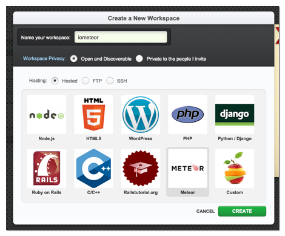
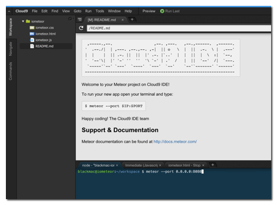

# Online entwickeln

Mit der [Online IDE Cloud9](https://c9.io/) kannst du direkt im Browser Meteor
Anwendungen schreiben. Cloud9 stellt während der Entwicklung sogar eine von
Aussen erreichbare SSL gesicherte URL zur Verfügung.
Beste Voraussetzungen um schnell und ohne komplizierte Konfiguration
einen Webservice für sipgate.io zu entwickeln.

Falls du es bevorzugst auf deinem lokalen Rechner zu entwickeln ist das auch
kein Problem. Die [Einrichtung ist zwar etwas komplizierter](02-Lokal.md), aber dafür
hast du jederzeit die Kontrolle über deinen Code.

## 1. Workspace anlegen

Um einen Meteor Workspace anzulegen musst du zunächst auf der linken Seite
der Cloud9 IDE "Create a New Workspace" anklicken.

Dann kannst du einen Namen für dein Projekt angeben (für dieses Beispiel
solltest du **iometeor** verwenden), "Meteor" auswählen und
"Create" klicken um dein Projekt zu erstellen.

## 2. Meteor starten

Nach einer kurzen Wartezeit erscheint die eigentliche Arbeitsumgebung. Um dort
Meteor zu starten gibst du einfach im unteren Bereich des Bildschirms
(Kommandozeile) folgenden Befehl ein:

    meteor --port 0.0.0.0:8080

Direkt danach läuft das Meteor Beispielprojekt unter

    https://iometeor-**benutzername**.c9.io/

